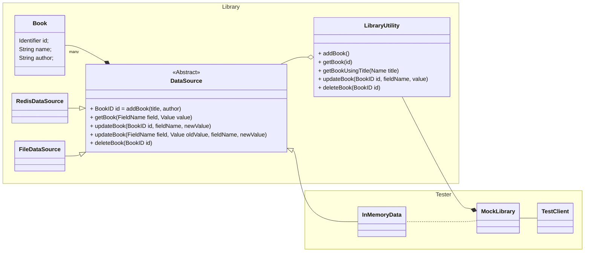

# digicert_library
A command-line utility in C++ to simulate a fictional public library

# Functional Requirements
* Provide ability to:
	* List all Books – Display all books in the library with relevant details (e.g., title, author, genre, availability).	
	* Add a Book – Allow users to add a new book.
	* View Book Details – Retrieve and display detailed information about a specific book.
	* Update a Book – Modify book details such as title, author, or availability.
	* Delete a Book – Remove a book from the library database.
* Support different storage options (a file or external storage)

# Non-Functional Requirements
* Performance –Utility needs to be fast and responsive.
* Scalability – Handle a large number of books efficiently.
* Reliability – Ensure data consistency and prevent corruption.
* Usability – Simple command-line interface with intuitive commands.
* Extensibility - Support multi-threading/multi-processing environments in the future. 
* Maintainability – Modular and well-structured C++ code for future enhancements.
* Portability – Should run on major operating systems (Windows, Linux, macOS).
* Testability - Modular code to support testability at various granularity like unit, integration, system tests.

# Open Questions:
* Will the utility be used in a multi-threaded/multi-processor environment?
* Will the utility be run as a service for distributed systems?

# Design Decisions:
* The Library utility will be intialised with a data source.
* The data source is configurable for a library instance.
* The data source will define the actions based on the storage it supports.
# Future Enhancements
* Support multiple authors for a single book
* Support multiple books written by a single author
* Support querying based on various criteria: getBook(author), getBook(title)
* Support nested queries
* Support multiple data sources. (Usecase: Search for a book in the cache and a database)
 

## Assumptions
* Single-threaded, Single-process environment
	* The data source would need to handle consistency requirements in multithreaded or multi-process environments.

# Architecture

